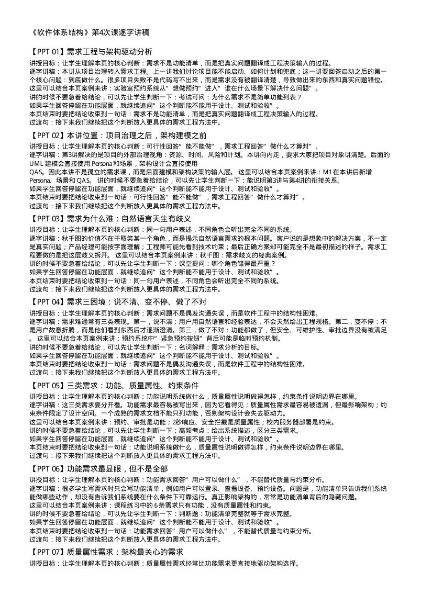
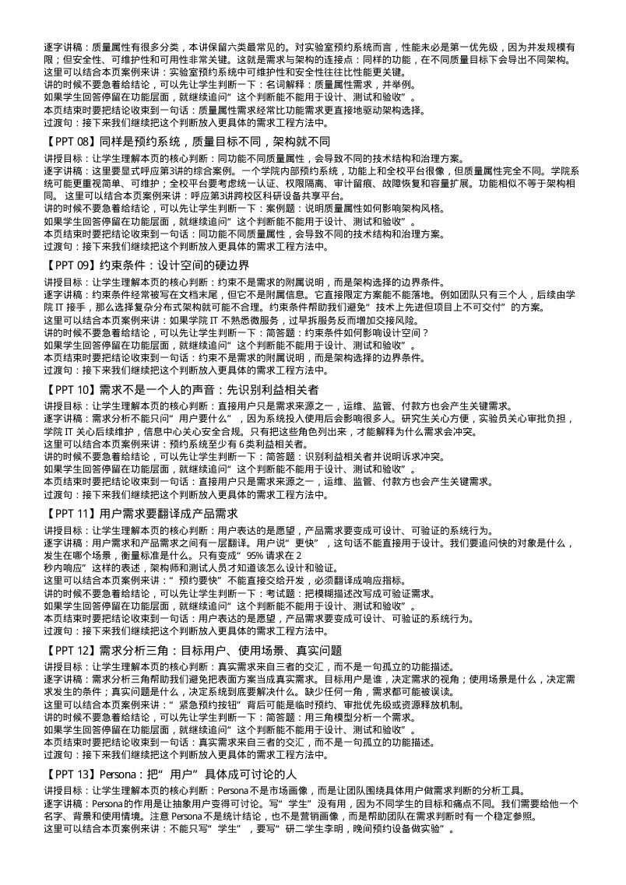
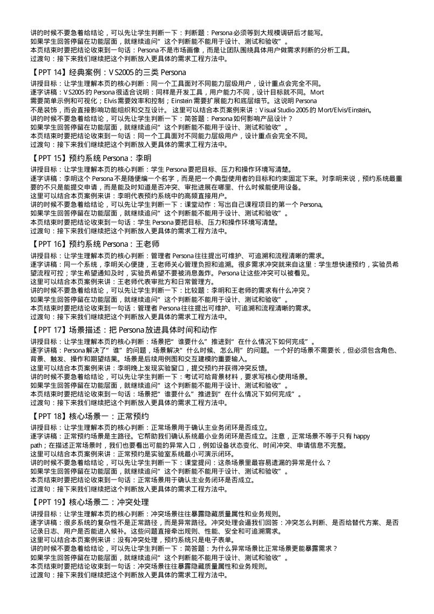
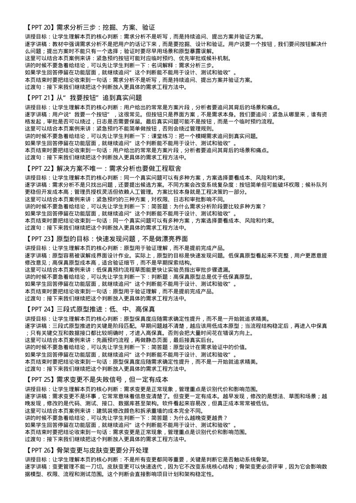
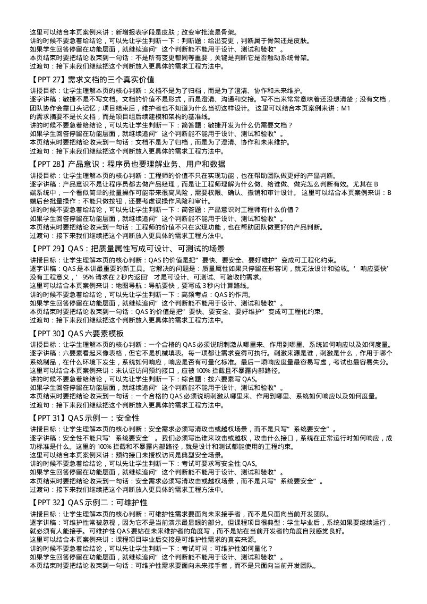
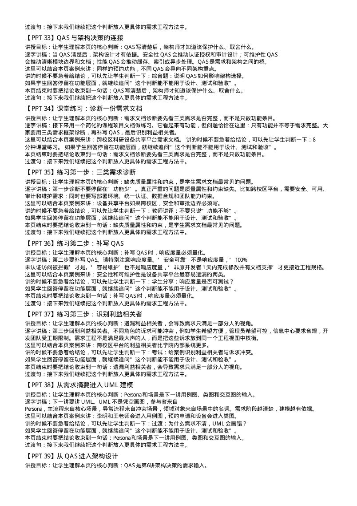
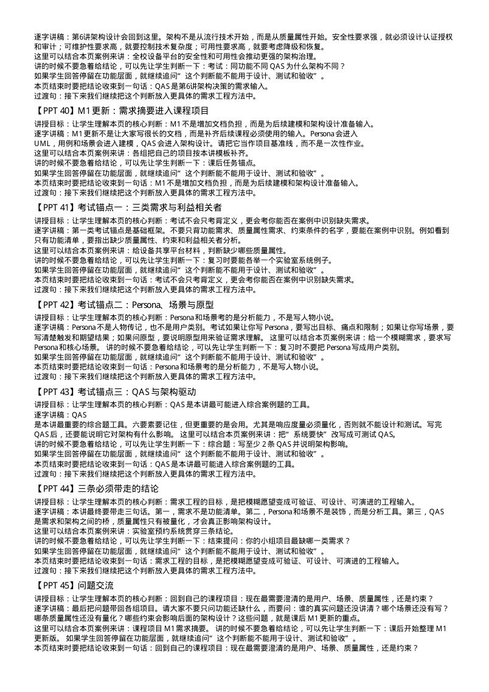

# 第04讲 需求工程：从用户声音到可验证规格

PPT作业第4章 需求工程：从用户声音到可验证规格

## 本讲核心问题

需求不是功能清单，而是把真实问题翻译成工程决策输入。

## 学习目标

- 理解本讲核心概念和判断规则；
- 能把本讲方法应用到课程项目；
- 能围绕案例说明工程取舍。

## PPT 在线预览

        

  <a class="md-button md-button--primary" href="../../assets/slides/lesson04.pdf" target="_blank">下载 PDF</a>
  <a class="md-button" href="../../assets/slides/lesson04.pdf" target="_blank">新窗口打开</a>

  <figure class="slide-preview-card">
    
    <figcaption>第 1 页</figcaption>
  </figure>
  <figure class="slide-preview-card">
    
    <figcaption>第 2 页</figcaption>
  </figure>
  <figure class="slide-preview-card">
    
    <figcaption>第 3 页</figcaption>
  </figure>
  <figure class="slide-preview-card">
    
    <figcaption>第 4 页</figcaption>
  </figure>
  <figure class="slide-preview-card">
    
    <figcaption>第 5 页</figcaption>
  </figure>
  <figure class="slide-preview-card">
    
    <figcaption>第 6 页</figcaption>
  </figure>
  <figure class="slide-preview-card">
    
    <figcaption>第 7 页</figcaption>
  </figure>
  <figure class="slide-preview-card">
    
    <figcaption>第 8 页</figcaption>
  </figure>

## 对应教材章节

第4章 需求工程：从用户声音到可验证规格

## 课堂任务

结合小组项目讨论本讲方法如何落地，并记录一条可执行改进。

## 课后作业

提交需求规格初稿，包含典型用户、使用场景、核心用例、非功能需求和原型草图。

[查看完整作业页面](../assignments/lesson04_assignment.md)

## 补充资料

可结合 [电子教材](../textbook/chapter04.md) 与 [补充资料中心](../resources/index.md) 复习。
