# 教材附图

教材附图来自学生版电子教材，用于复习核心框架、流程和结构图。

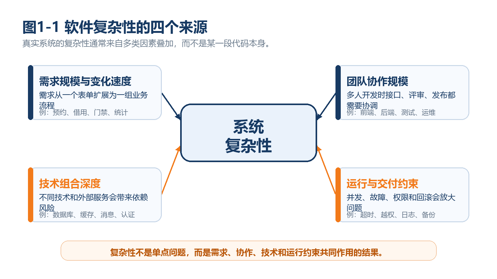
fig1-1_complexity_sources_native

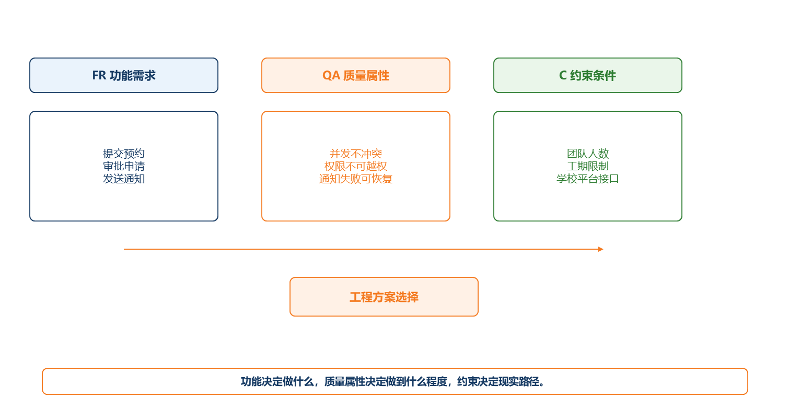
fig1-2_fr_qa_c_native

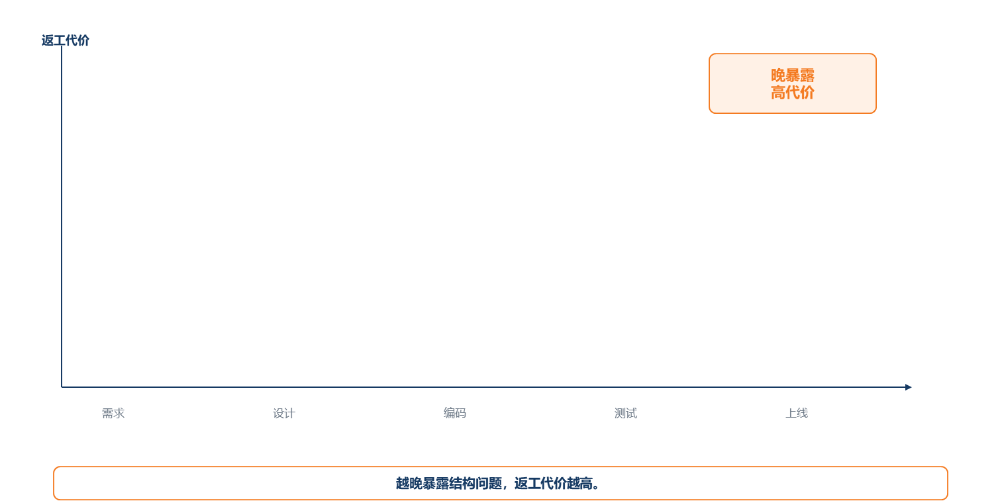
fig1-3_architecture_time_debt_native

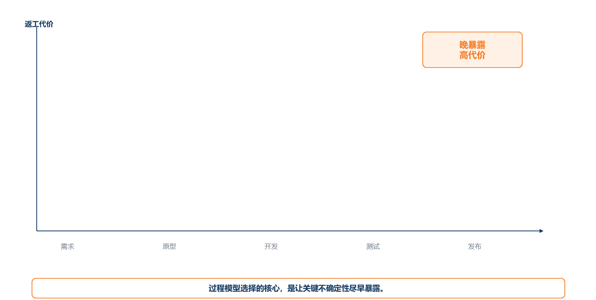
fig2-1_rework_cost_native

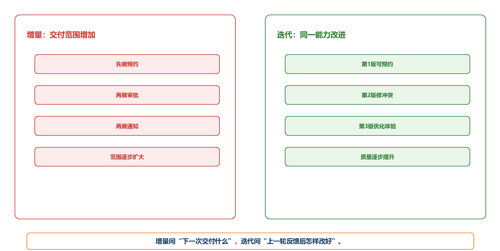
fig2-2_increment_iteration_native

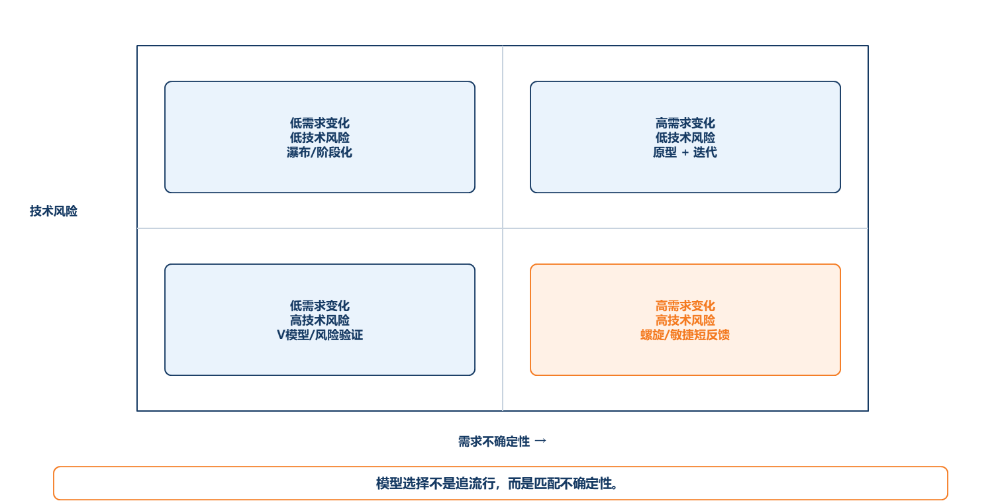
fig2-3_process_choice_matrix_native

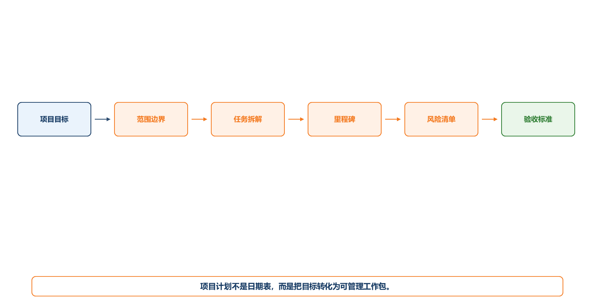
fig3-1_goal_to_plan_native

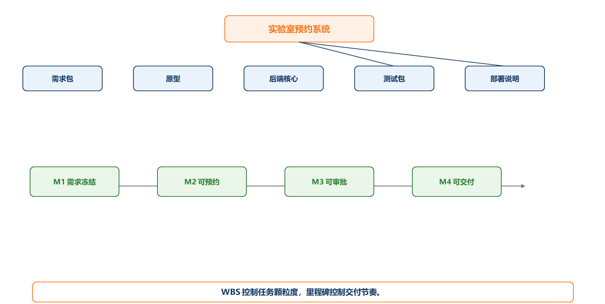
fig3-2_wbs_milestone_native

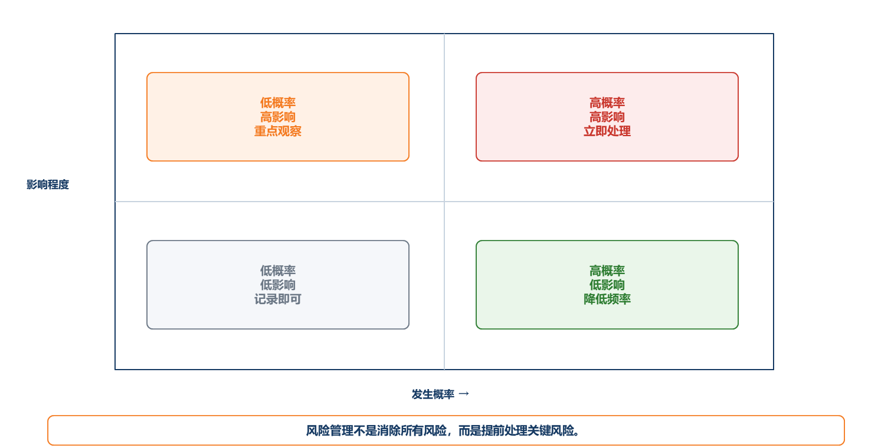
fig3-3_risk_matrix_native

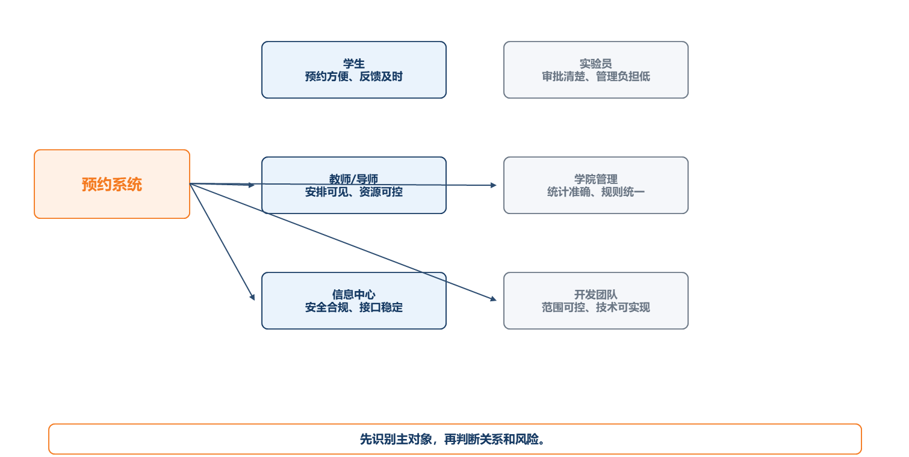
fig4-1_stakeholder_map_native

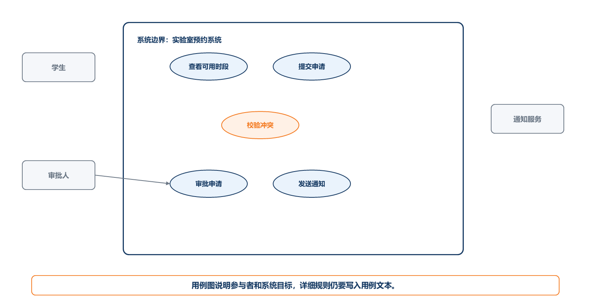
fig4-2_use_case_native

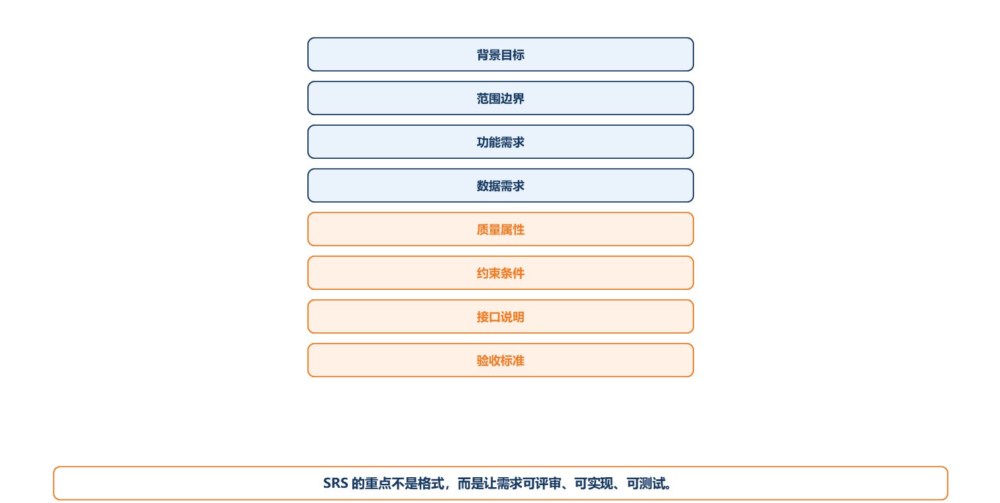
fig4-3_srs_structure_native

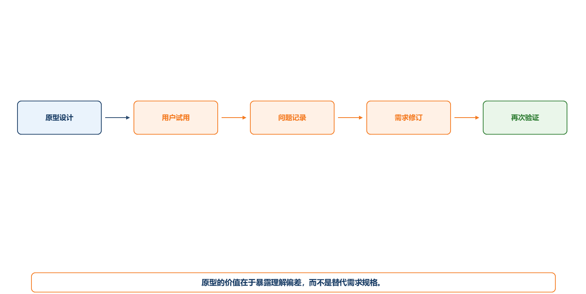
fig4-4_prototype_feedback_native

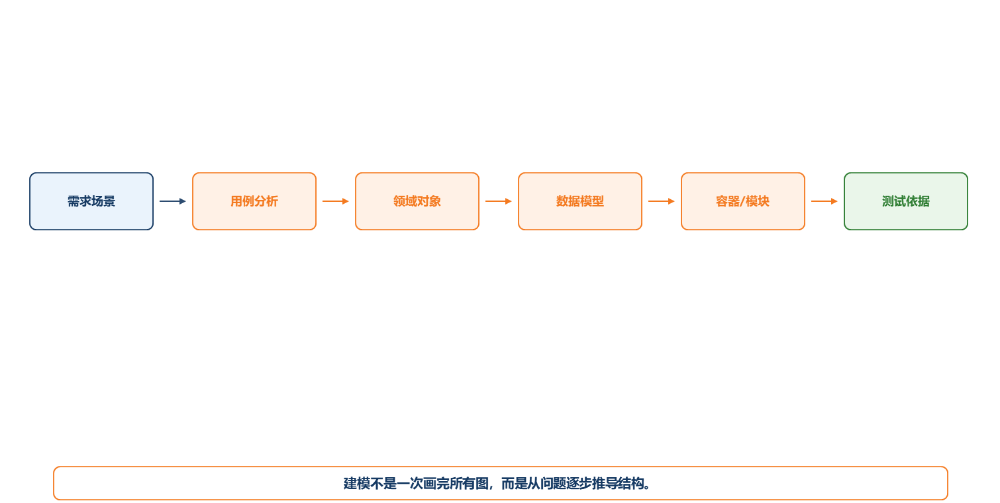
fig5-1_modeling_chain_native

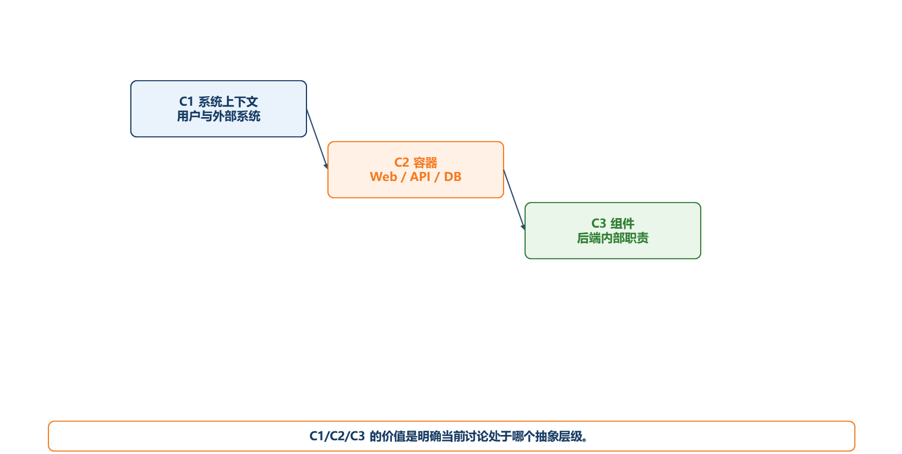
fig5-2_c4_levels_native

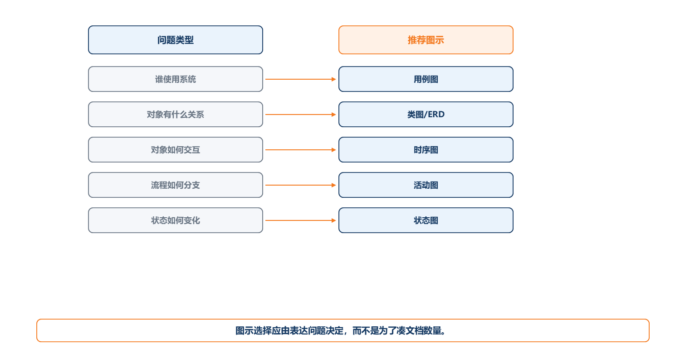
fig5-3_uml_choice_matrix_native

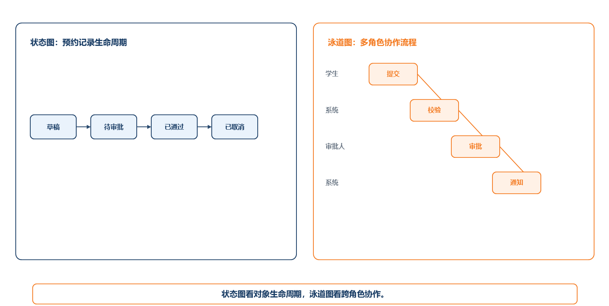
fig5-4_state_swimlane_native

fig6-1_quality_attribute_to_architecture_native

fig6-2_modular_monolith_structure_native

fig6-3_adr_structure_native

fig6-4_distributed_monolith_vs_microservices_native

fig6-5_sync_vs_async_notification_native

fig7-1_testability_conditions_native

fig7-2_test_pyramid_native

fig7-3_quality_gate_native

fig8-1_ci_flow_native

fig8-2_release_strategies_native

fig8-3_observability_native

fig8-4_incident_review_native

