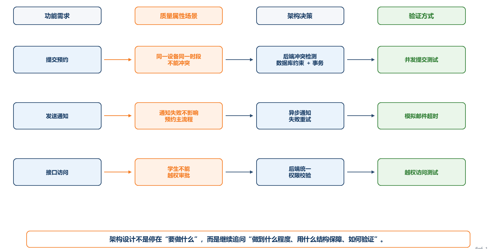
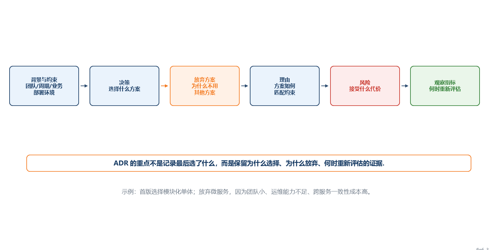
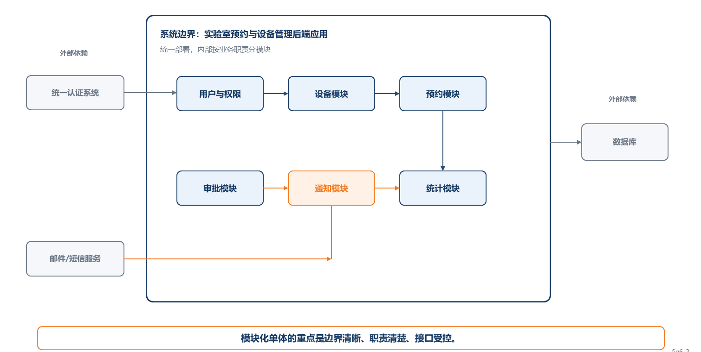
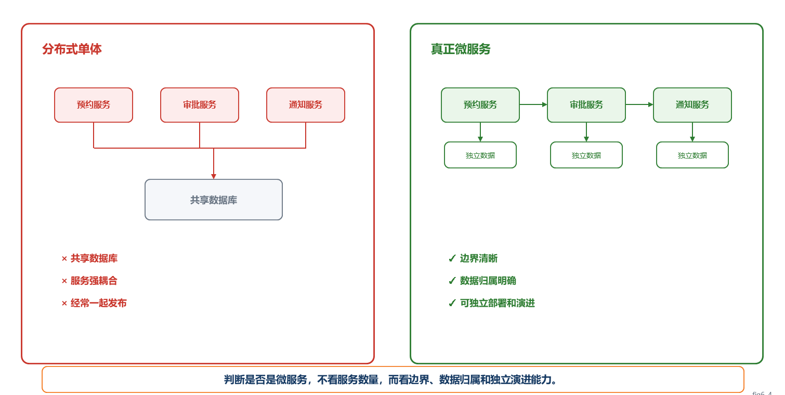
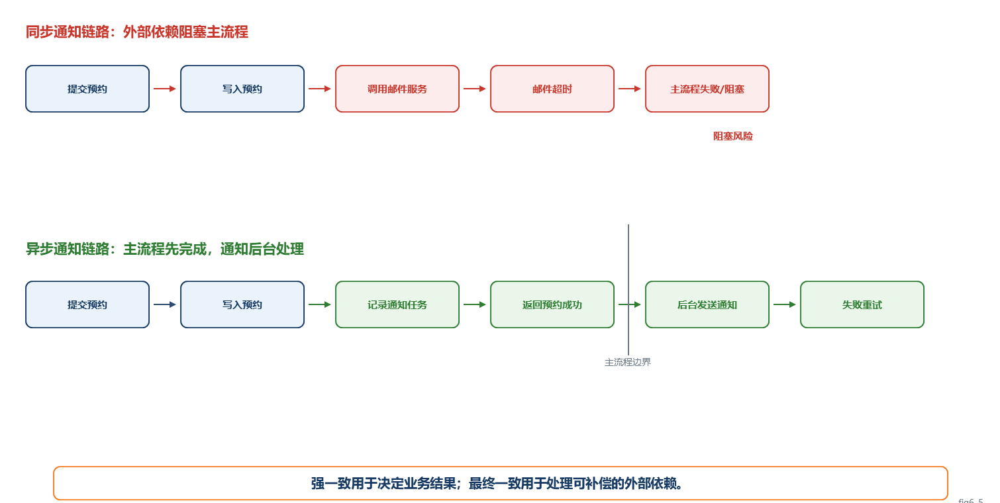

# 第6章 架构设计、架构风格与分布式系统

## 6.1 本章导读：为什么功能能跑不代表架构合理

软件系统的危险之处在于：很多设计问题在第一天并不会暴露。页面能打开，按钮能点击，数据库能保存记录，用户看起来也能完成操作。但当系统开始被多人同时使用，开始接入外部服务，开始增加新角色和新规则，原来“能跑”的设计就可能迅速变成“没人敢改”的系统。

以“实验室预约与设备管理系统”为例，首版功能并不复杂：学生查看设备并提交预约，实验员审批，教师查看安排，系统发送通知。如果只看功能清单，这似乎就是几个页面、几张表和几个接口。但是系统一旦进入真实使用，就会遇到架构问题。

例如，两名学生同时预约同一台设备、同一时间段，系统能否保证只产生一条有效预约？邮件服务临时不可用时，预约是否应该失败？普通学生能否通过修改接口参数访问管理员功能？后续如果增加“学院级设备共享”“跨实验室借用”“设备维修状态联动”，系统是否还能在不大改的情况下演进？

这些问题不是简单的编码问题，而是架构决策问题。架构设计关心的不是“代码能不能写出来”，而是系统如何组织，边界如何划分，哪些链路必须强一致，哪些能力可以异步处理，哪些风险要被记录，哪些技术债可以暂时接受。

本章的目标是帮助学生建立一个基本判断：架构不是技术栈清单，而是在约束条件下对系统结构做出的关键决策。

【你要记住】
本章最重要的判断不是“哪种架构最先进”，而是“在当前约束下，哪种结构决策更能控制复杂性，并且能说明取舍理由”。

## 6.2 一个反面案例：实验室预约系统的“快写版”设计

### 6.2.1 前因：为了尽快完成首版

某小组要在较短时间内完成实验室预约系统。为了尽快看到效果，团队采用了最直接的写法：

- 所有业务逻辑都写在 Controller 中。
- 预约冲突主要靠前端判断。
- 预约成功后同步调用邮件接口发送通知。
- 权限主要靠前端隐藏按钮控制。
- 数据表能满足当前页面即可，没有明确模块边界。
- 没有记录任何架构决策，也没有说明为什么这样设计。

短期看，这种设计很有吸引力。页面很快做出来，接口也能跑通，演示时学生可以提交预约，实验员可以审批，系统也能发送通知。问题在于，这种“快写版”只是功能跑通，并没有真正控制复杂性。

### 6.2.2 冲突：真实使用后问题集中暴露

当系统进入真实场景后，问题开始出现。

第一，预约冲突无法可靠避免。前端判断设备是否空闲，只能看到页面加载时的状态。两个学生几乎同时提交预约时，前端都认为该时段可用，后端如果没有事务、唯一约束或锁机制，就可能产生两条有效预约。

第二，通知失败影响主流程。预约已经写入数据库，但邮件服务超时，接口等待很久后返回失败。用户看到“预约失败”，但后台可能已经保存了预约记录，造成状态不一致。

第三，权限边界不可靠。前端隐藏了“审批”按钮，但如果学生直接调用审批接口，后端没有统一权限校验，就可能出现越权操作。

第四，维护成本快速上升。所有逻辑堆在 Controller 中，预约、审批、通知、权限和设备状态互相交织。新增“导师确认”规则时，开发者不知道应该改哪里，也不确定改完会影响哪些流程。

### 6.2.3 后果：系统从“能跑”变成“难改”

这种设计的最大风险不是首版无法演示，而是后续无法稳定演进。系统会出现几类后果：

- 缺陷定位困难：出问题时无法判断是预约规则、审批规则、通知服务还是权限控制导致。
- 修改影响范围不可控：改一个审批条件可能影响预约状态、通知发送和统计报表。
- 测试困难：业务逻辑和外部依赖耦合在一起，无法单独测试核心规则。
- 安全风险上升：权限散落在页面和接口中，容易遗漏。
- 团队协作变慢：每个人都怕改到别人负责的逻辑。

### 6.2.4 改法：用架构决策替代临时拼接

改进不是简单地换一个框架，而是重新明确结构决策：

- 预约冲突检测放在后端核心业务规则中，并通过数据库约束、事务或锁机制保障一致性。
- 通知从主流程中拆出，预约成功后记录通知任务，邮件发送异步执行，失败可重试。
- 权限模型统一放在后端，前端隐藏按钮只作为体验优化，不作为安全边界。
- 后端按业务职责划分模块，例如用户权限、设备、预约、审批、通知、统计。
- 对关键选择写 ADR，说明为什么首版采用模块化单体，为什么通知异步，为什么权限统一后端校验。

这个案例说明：架构设计不是在功能之后“画一张漂亮图”，而是在系统还小的时候就把关键边界和取舍说清楚。

这个反面案例可以概括为一条推演链：错误方案是把功能快速堆到一起；问题暴露在并发、外部依赖、权限和维护变化中；架构判断要识别哪些链路必须强一致、哪些能力可以异步、哪些边界必须统一；改进方案则是用模块化单体、后端一致性控制、异步通知、统一权限模型和 ADR 记录来控制复杂性。

【易错点】
“首版能演示”不等于“架构合理”。演示通常只覆盖正常路径，真实系统会暴露并发、失败、越权和后续变化问题。

## 6.3 架构设计到底在决策什么

### 6.3.1 架构是关键结构决策的集合

架构设计关注的是那些影响范围大、回退代价高、长期影响系统演进的选择。它回答的问题包括：

- 系统由哪些主要部分组成？
- 各部分之间如何协作？
- 数据如何流动和保持一致？
- 外部依赖失败时系统如何处理？
- 质量属性通过什么结构得到保障？
- 后续变化发生时，哪些部分可以稳定，哪些部分可以替换？

对实验室预约系统来说，以下选择属于架构决策：

- 首版采用模块化单体，而不是微服务。
- 预约冲突检测必须由后端保障强一致。
- 通知采用异步任务，不阻塞预约主流程。
- 权限校验统一在后端完成。
- 外部统一认证系统通过适配层接入，避免业务核心直接依赖具体接口。

这些决策会影响模块划分、数据设计、测试方式、部署方式和后续演进，因此属于架构层面的选择。

### 6.3.2 什么不是关键决策

并不是所有技术选择都是架构决策。以下内容通常不是架构重点：

- 按钮颜色、页面布局等纯界面细节。
- 普通变量命名、局部函数写法。
- 不影响系统结构的小工具库选择。
- 可以低成本替换的局部实现细节。

当然，如果某个工具选择会影响系统结构、团队协作或长期演进，它也可能上升为架构决策。例如，是否引入消息队列就不只是工具选择，因为它会改变同步调用关系、失败处理方式和测试策略。

### 6.3.3 技术栈与架构理由的区别

“Vue + Spring Boot + MySQL + Redis”不是架构方案，只是技术栈清单。技术栈回答“用了什么”，架构方案回答“为什么这样组织系统”。

【考试提示】
如果题目要求说明“为什么技术栈清单不能代替架构方案”，答题时至少要写出：技术栈只说明工具，架构方案还要说明模块边界、协作方式、质量属性、风险和取舍理由。

一个更合格的表达应类似这样：

- 前端只负责交互和状态展示，不承担预约冲突的最终判断。
- 后端按预约、设备、审批、通知、权限划分模块。
- 预约冲突由数据库唯一约束和业务事务共同保障。
- 通知从主流程中异步拆出，失败记录并重试。
- Redis 只用于缓存设备展示信息，不作为预约可用性的最终判断依据。

这里的重点不是用了哪些技术，而是说明了责任边界、一致性策略和故障处理方式。

### 6.3.4 Redis 例子：工具名不是架构，取舍才是架构

如果方案中只写“使用 Redis 提升性能”，这仍然不够。架构层面至少要追问：

- 缓存什么数据？设备列表、设备详情，还是预约时段？
- 缓存何时失效？审批通过、设备维修、预约取消时是否更新？
- 缓存和数据库不一致时，以谁为准？
- 缓存故障时，系统是降级、回源数据库，还是直接失败？
- 缓存是否参与预约冲突判断？

对于实验室预约系统，设备展示信息可以缓存，因为短时间不一致通常可以接受；但预约占用状态不应只依赖缓存，因为错误的可用状态会直接导致冲突预约。这个判断才是架构问题。

【易错点】
Redis 不是架构理由。“缓存什么、何时失效、与数据库不一致时以谁为准、缓存故障时如何降级”，这些才是架构设计需要回答的问题。

## 6.4 质量属性如何驱动架构选择

### 6.4.1 功能需求与质量属性的区别

功能需求说明系统要做什么，质量属性说明系统要以什么质量完成这些功能。

| 类型 | 示例 | 对架构的影响 |
|---|---|---|
| 功能需求 | 学生可以提交预约申请 | 需要预约提交接口、页面和数据表 |
| 一致性要求 | 同一设备同一时段不能出现两条有效预约 | 影响事务、锁、唯一约束和并发控制 |
| 可用性要求 | 通知服务失败不能导致预约失败 | 影响同步/异步拆分和失败重试机制 |
| 安全性要求 | 学生不能调用实验员审批接口 | 影响统一认证、授权和接口权限校验 |
| 可维护性要求 | 新增审批规则时不应改动大量无关代码 | 影响模块边界、业务规则位置和依赖方向 |

架构设计最重要的工作之一，就是把“系统要稳定、安全、可维护”这类泛泛表述，转化为具体的质量场景和结构决策。

**图6-1 质量属性如何驱动架构决策**

图注：本图说明功能需求需要进一步转化为质量属性场景，再落到架构决策和验证方式。

### 6.4.2 强一致如何影响数据库和事务设计

预约占用属于核心业务正确性。若系统允许同一设备同一时段出现两个有效预约，即使之后可以人工修正，也已经破坏了用户信任。因此预约占用不能只靠前端判断，也不适合简单采用最终一致。

合理做法包括：

- 后端统一检查预约时段是否可用。
- 数据库层增加唯一约束或排他约束。
- 预约提交过程使用事务保证状态变化原子性。
- 并发高时考虑锁机制或基于版本号的并发控制。

这里的架构判断是：预约结果必须强一致，通知结果可以延迟。

### 6.4.3 可用性如何影响异步通知

通知很重要，但它不应阻塞预约主流程。若邮件服务故障导致预约失败，用户会遇到不合理体验：明明设备时段已占用，却因为邮件服务不可用而无法完成预约。

更合理的做法是：

- 预约成功后先记录通知任务。
- 后台异步发送邮件或站内消息。
- 通知失败时记录错误并重试。
- 管理端可以查看通知失败记录。

这样做牺牲的是通知的即时性，换来的是预约主流程的可用性。

### 6.4.4 安全性如何影响统一权限模型

权限不能只依赖前端。前端隐藏按钮只能减少误操作，不能阻止恶意或误用接口。系统必须在后端统一判断用户身份、角色和资源权限。

例如：

- 学生只能查看和取消自己的预约。
- 实验员只能审批自己负责实验室的预约。
- 指导教师只能查看与自己指导相关的实验安排。
- 学院管理员可以配置规则，但不能绕过审计。

这些规则如果分散在多个 Controller 中，后续新增角色时很容易遗漏。统一权限模型能提升安全性，也能提升可维护性。

### 6.4.5 可维护性如何影响模块边界

可维护性不是“代码写得整洁”这么简单。它要求系统的变化能被限制在合理范围内。

实验室预约系统至少应划分以下业务模块：

- 用户与权限模块：负责身份、角色和授权。
- 设备模块：负责设备信息、状态和维护。
- 预约模块：负责预约申请、取消、冲突检测。
- 审批模块：负责审批流程和规则。
- 通知模块：负责消息生成、发送、失败重试。
- 统计模块：负责使用率、预约量和报表。

模块边界清楚时，新增“设备维修期间禁止预约”规则，主要影响设备和预约模块；新增“审批结果通知导师”，主要影响审批和通知模块。边界不清时，任何变化都可能牵动全系统。

## 6.5 ADR：把架构选择写成可审查的理由

### 6.5.1 为什么需要 ADR

架构决策如果只停留在口头，很快就会丢失上下文。几周后团队可能只记得“当时选了模块化单体”，却忘了为什么没有选微服务；几个月后新成员加入，只能从代码中猜测设计意图。

ADR 的作用是保留决策背景和取舍过程。它不需要很长，但要能回答三个问题：

- 当时面对什么约束？
- 为什么选这个方案？
- 什么情况下需要重新评估？

### 6.5.2 完整 ADR 示例

**ADR-001：首版采用模块化单体**

| 项目 | 内容 |
|---|---|
| 背景 | 实验室预约系统首版由5人小组在6周内完成，业务边界尚在验证中，部署环境简单，团队缺少复杂运维经验。系统需要支持预约、审批、设备管理、通知和权限控制。 |
| 决策 | 首版采用模块化单体。系统统一部署为一个后端应用，内部按用户权限、设备、预约、审批、通知、统计划分模块。模块之间通过清晰接口协作，避免任意跨模块访问数据表。 |
| 放弃方案 | 暂不采用微服务。原因是服务拆分会引入独立部署、服务发现、接口治理、分布式事务、链路追踪等成本，超出首版团队能力和项目周期。也不采用无边界的简单单体，因为它会导致后续难以维护。 |
| 理由 | 模块化单体能降低部署和调试复杂度，适合小团队首版交付；同时通过内部模块边界保留后续演进空间。 |
| 风险 | 如果模块边界执行不严格，系统仍可能退化为“大泥球”；如果后续用户规模显著扩大，单体部署可能限制独立扩展。 |
| 观察指标 | 模块间循环依赖数量；新增需求修改影响范围；部署耗时；缺陷定位时间；是否出现某个模块需要独立扩展的压力。 |

### 6.5.3 逐项解释

**背景**说明决策面对的条件。没有背景，决策就像脱离现场的结论。例如“采用模块化单体”本身没有绝对正确，只有在“5人团队、6周首版、运维能力有限、业务边界尚未稳定”这个背景下才更合理。

**决策**要写清楚最终选择，而不是只写技术名词。这里不是简单写“采用 Spring Boot”，而是说明统一部署、内部模块划分和模块协作原则。

**放弃方案**最能体现架构判断。只写“选了模块化单体”无法证明经过权衡；写清“为什么暂不采用微服务，为什么也不接受无边界简单单体”，才能让别人审查这个决策是否合理。

【你要记住】
ADR 中最容易被漏掉、也最能体现专业判断的是“放弃方案”。它说明团队不是只写了一个结论，而是真的比较过其他可能性。

**理由**连接背景和决策，说明为什么该方案匹配当前约束。

**风险**承认当前方案不是完美方案。架构决策不是寻找没有缺点的方案，而是在已知条件下接受可管理的风险。

**观察指标**用于后续复盘。如果未来模块间依赖越来越乱，部署越来越慢，缺陷定位越来越困难，就说明原有决策需要调整。

**图6-3 ADR结构示意图**

图注：本图说明 ADR 是一条可审查的架构推理链，重点是保留选择、放弃和重新评估的理由。

## 6.6 架构风格不是名词表，而是问题匹配

架构风格不应被当作名词背诵。判断一种风格是否合适，应先看它解决什么问题，再看它引入什么成本，最后看团队是否具备使用它的条件。

### 6.6.1 结构组织类：分层、模块化单体、六边形架构

这类风格主要解决“系统内部如何组织”的问题。

| 风格 | 解决的问题 | 适用条件 | 引入成本 | 课程项目建议 |
|---|---|---|---|---|
| 分层架构 | 区分表现层、业务层、数据访问层，避免页面直接操作数据库 | 业务复杂度不高，需要建立基本工程结构 | 若业务规则散落在各层，可能形成贫血模型 | 推荐作为基础结构 |
| 模块化单体 | 在一个部署单元内保持清晰业务边界 | 小团队、首版交付、业务边界还在探索 | 需要自律维护模块边界 | 强烈推荐 |
| 六边形架构 | 隔离业务核心与外部技术依赖 | 业务规则重要，外部接口可能变化，测试要求高 | 抽象成本较高，小项目容易过度设计 | 可在关键模块局部使用 |

对于实验室预约系统，推荐采用“分层 + 模块化单体”。核心预约规则可以更接近六边形架构思想：业务规则不要直接依赖邮件接口、统一认证接口或具体数据库细节。

### 6.6.2 扩展复用类：组件化、插件化、DDD 限界上下文

这类风格主要解决“能力如何复用，变化如何隔离”的问题。

| 风格 | 解决的问题 | 适用条件 | 引入成本 | 课程项目建议 |
|---|---|---|---|---|
| 组件化 | 把可复用功能封装为组件 | 多处使用同类功能，如表格、审批状态、通知模板 | 需要稳定接口和版本管理 | 推荐在前端或公共能力中使用 |
| 插件化 | 让系统通过扩展点接入新能力 | 业务扩展点明确，如多种通知渠道、多种报表导出 | 设计扩展点有成本，过早插件化会变复杂 | 谨慎使用，只在明确扩展点使用 |
| DDD 限界上下文 | 用业务边界控制模型含义 | 业务概念复杂，不同部门对同一术语含义不同 | 学习成本较高，需要深入业务建模 | 可借鉴“边界”思想，不必完整套用 |

例如“预约”在学生视角是申请，在实验员视角是审批任务，在统计视角是设备使用记录。若系统规模扩大，需要更认真地区分这些上下文；但在课程项目首版中，不必把 DDD 术语全部搬进方案，只需要把业务边界说清。

### 6.6.3 分布运行类：SOA、微服务、事件驱动

这类风格主要解决“系统如何跨进程、跨服务、跨组织协作”的问题。

| 风格 | 解决的问题 | 适用条件 | 引入成本 | 课程项目建议 |
|---|---|---|---|---|
| SOA | 多系统共享服务能力 | 组织内已有多个系统，需要复用认证、报表、设备数据等能力 | 服务治理和接口管理复杂 | 可理解，不建议首版完整实现 |
| 微服务 | 独立部署、独立扩展、团队自治 | 业务边界清晰，团队规模较大，具备 DevOps、监控和自动化测试能力 | 分布式事务、链路追踪、部署治理成本高 | 不建议小团队首版默认采用 |
| 事件驱动 | 异步解耦、削峰、状态传播 | 通知、审计、统计、异步任务等场景明显 | 调试复杂，需要处理幂等、顺序和失败重试 | 可局部用于通知和审计 |

对实验室预约系统，通知、审计和统计适合借鉴事件驱动思想；预约占用、权限校验等核心链路不宜轻易异步化。

### 6.6.4 四组快速对比

**简单单体 vs 模块化单体**

| 对比项 | 简单单体 | 模块化单体 |
|---|---|---|
| 内部边界 | 不清晰，逻辑容易混在一起 | 按业务职责划分模块 |
| 部署方式 | 一个应用 | 一个应用 |
| 维护成本 | 随规模上升很快变高 | 通过模块边界控制变化 |
| 课程项目建议 | 不推荐 | 推荐 |

**模块化单体 vs 微服务**

| 对比项 | 模块化单体 | 微服务 |
|---|---|---|
| 部署复杂度 | 低 | 高 |
| 适用团队 | 小团队、首版项目 | 较大团队、边界清晰 |
| 数据一致性 | 相对容易处理 | 需要处理分布式一致性 |
| 课程项目建议 | 首选 | 不作为默认答案 |

**微服务 vs 分布式单体**

| 对比项 | 真正微服务 | 分布式单体 |
|---|---|---|
| 服务边界 | 清晰，围绕业务能力 | 表面拆开，实际强耦合 |
| 数据归属 | 明确 | 常共享数据库 |
| 发布方式 | 可独立发布 | 经常必须一起发布 |
| 判断结论 | 有自治能力 | 复杂度上升但收益不足 |

**同步调用 vs 异步事件**

| 对比项 | 同步调用 | 异步事件 |
|---|---|---|
| 适合场景 | 需要立即结果和强一致 | 通知、审计、统计、削峰 |
| 优点 | 流程直接，结果明确 | 解耦主流程，提高可用性 |
| 风险 | 外部依赖会阻塞主流程 | 调试、幂等、重试更复杂 |
| 预约系统示例 | 提交预约、权限判断 | 通知发送、统计更新 |

【项目提示】
课程项目首版不要为了“显得高级”而默认写微服务。若团队不能说明服务边界、数据归属、独立部署和故障处理方式，优先采用模块化单体。

## 6.7 模块化单体、微服务与分布式单体

### 6.7.1 为什么小团队首版更适合模块化单体

课程项目通常具有几个特点：团队人数少，周期短，业务边界还在探索，部署和运维能力有限。在这种条件下，模块化单体通常比微服务更合适。

模块化单体的优势是：

- 一个应用部署，环境简单。
- 本地调试和测试成本低。
- 事务和一致性处理更直接。
- 通过内部模块边界保留演进空间。

它并不等于“随便写成一个大单体”。真正的模块化单体要求内部边界清晰、依赖方向受控、业务规则有明确归属。

### 6.7.2 什么是真正的模块化单体

真正的模块化单体至少应满足：

- 按业务职责划分模块，而不是按个人分工随意划分。
- 模块之间通过接口协作，不随意访问彼此内部数据。
- 核心业务规则不散落在 Controller 或页面脚本中。
- 模块依赖方向清楚，避免循环依赖。
- 保留后续拆分可能性，但不为未来不确定需求过度设计。

实验室预约系统中，预约模块可以调用设备模块查询设备状态，可以调用通知模块创建通知任务，但不应直接修改通知模块内部表结构。审批模块可以改变预约状态，但状态流转规则应有统一位置维护。

【你要记住】
模块化单体不是“一个应用随便写”。它的关键是内部模块边界清晰、依赖方向受控、业务规则有明确归属。

**图6-2 实验室预约系统模块化单体结构**

图注：本图说明模块化单体可以统一部署，但内部仍要保持清晰的业务边界和受控依赖。

### 6.7.3 什么情况下可以考虑微服务

可以考虑微服务的条件包括：

- 业务边界已经稳定，不同服务有清晰职责。
- 团队规模足够，每个服务能由相对独立的小组负责。
- 系统需要独立部署、独立扩展或故障隔离。
- 团队具备自动化测试、持续交付、监控告警和故障排查能力。
- 能接受分布式一致性、接口版本管理和链路追踪带来的成本。

如果只是为了“看起来先进”而拆服务，往往得不到微服务收益，只会提前承担分布式复杂性。

【易错点】
微服务不是默认答案。只有业务边界清晰、团队具备独立部署和运维能力、服务确实需要独立扩展时，微服务才可能带来收益。

### 6.7.4 什么是分布式单体

分布式单体是最常见的错误形态：系统被拆成多个服务，但服务之间高度耦合，必须一起发布、一起修改、一起回滚。它既失去了单体的简单性，又没有获得微服务的独立性。

典型表现包括：

- 服务之间互相调用链很深，任何小改动都牵动多个服务。
- 数据库表仍然被多个服务共享和直接修改。
- 一个服务无法独立测试，必须启动全部服务。
- 发布一个小功能需要多个服务同时上线。
- 接口没有版本治理，调用方和提供方互相卡住。

“拆成多个服务”不等于微服务。真正的微服务要求业务边界清晰、数据归属明确、服务能独立部署和独立演进。

**图6-4 分布式单体 vs 真正微服务**

图注：本图对比共享数据库、强耦合的分布式单体与边界清晰、可独立演进的微服务。

### 6.7.5 实验室预约系统对比

| 方案 | 做法 | 短期效果 | 长期风险 | 判断 |
|---|---|---|---|---|
| 简单单体 | 所有逻辑堆在一个应用中，模块边界不清 | 开发最快 | 难维护、难测试、难演进 | 不推荐 |
| 模块化单体 | 一个应用部署，内部按业务模块划分 | 交付稳定，成本可控 | 需要持续维护边界 | 首版推荐 |
| 分布式单体 | 拆成多个服务，但共享数据库、一起发布 | 看似现代 | 调试、部署、一致性成本都上升 | 应避免 |
| 真正微服务 | 服务自治、数据归属明确、独立部署 | 适合较大规模 | 对工程能力要求高 | 后续演进可考虑 |

## 6.8 同步、异步与一致性取舍

### 6.8.1 预约占用为什么不能最终一致

预约占用直接决定业务正确性。若两个用户同时预约同一设备，系统必须立即给出唯一结果。不能先让两人都成功，再通过异步任务修正其中一个。因为用户已经基于系统结果安排实验时间，事后修正会造成实际损失。

因此，预约占用链路应强一致：

- 后端统一执行冲突检测。
- 数据库层提供唯一约束或排他控制。
- 状态更新在事务中完成。
- 并发提交时必须有确定结果。

### 6.8.2 通知为什么可以异步

通知与预约结果相关，但它不是预约是否成立的最终依据。邮件晚到几分钟通常可以接受，邮件失败后也可以重试或通过站内消息补偿。

因此，通知适合异步处理：

- 预约成功后生成通知任务。
- 后台任务或消息队列负责发送。
- 发送失败记录原因并重试。
- 管理端可查看失败通知。

这种设计将“预约是否成功”和“通知是否送达”分开，避免外部服务故障拖垮核心业务。

**图6-5 同步通知 vs 异步通知链路对比**

图注：本图说明预约占用属于主业务结果，应保持强一致；通知送达属于外部依赖，可异步处理并最终一致。

### 6.8.3 哪些链路必须强一致

通常应强一致的链路包括：

- 设备时段占用。
- 预约状态流转。
- 权限授权结果。
- 付款或扣费类操作。
- 影响业务唯一性的关键记录。

这些链路一旦错误，系统会产生直接业务损害。

### 6.8.4 哪些链路可以最终一致

通常可以最终一致的链路包括：

- 邮件、短信、站内通知。
- 使用率统计。
- 操作审计归档。
- 搜索索引更新。
- 报表汇总。

这些能力重要，但短暂延迟通常可接受。架构设计应把它们从主流程中拆出，减少同步依赖。

### 6.8.5 质量属性之间的取舍

架构设计不是让所有质量属性同时最大化，而是在冲突中排序。

| 取舍 | 示例 | 判断 |
|---|---|---|
| 一致性 vs 性能 | 预约占用需要强一致，可能增加锁和事务成本 | 预约正确性优先 |
| 可用性 vs 即时性 | 通知异步后不保证立即送达 | 主流程可用性优先 |
| 安全性 vs 开发速度 | 后端统一权限增加开发工作 | 安全边界优先 |
| 可维护性 vs 短期速度 | 模块边界设计增加前期成本 | 长期可维护性优先 |

### 6.8.6 业务动作与一致性要求对照表

| 业务动作 | 一致性要求 | 原因 | 推荐处理方式 |
|---|---|---|---|
| 提交预约 | 强一致 | 同一设备同一时段不能出现两条有效预约 | 后端校验 + 数据库约束 + 事务/锁 |
| 取消预约 | 强一致 | 取消后设备时段应立即释放，避免状态混乱 | 状态更新放入事务，记录操作日志 |
| 发送通知 | 最终一致 | 通知晚到可接受，不应阻塞预约主流程 | 异步任务/消息队列 + 失败重试 |
| 统计报表 | 最终一致 | 报表允许分钟级或小时级延迟 | 定时汇总或事件驱动更新 |
| 权限判断 | 强一致 | 越权访问会造成安全问题 | 后端统一鉴权与授权校验 |
| 搜索索引更新 | 最终一致 | 搜索结果短暂延迟通常可接受 | 异步索引更新，必要时回源查询 |

【考试提示】
判断同步还是异步时，不要只看实现是否方便，要看业务结果是否允许延迟修正。预约占用和权限判断通常不能延迟修正，通知和统计通常可以。

## 6.9 技术债：有意接受的风险要被记录

技术债不是“代码写得差”的同义词。更准确地说，技术债是团队为了短期目标有意接受的工程风险。它可能是合理的，但必须被记录和管理。

例如，首版实验室预约系统为了赶上展示，可能暂时不接入真实短信服务，只实现邮件通知和站内消息。这不一定错误，但它应该被记录为技术债：当前为什么接受，影响范围是什么，未来什么时候补齐。

### 6.9.1 技术债记录表示例

| 字段 | 示例 |
|---|---|
| 技术债名称 | 首版未接入短信通知，仅支持邮件和站内消息 |
| 为什么接受 | 项目周期有限，短信接口申请和费用审批耗时较长；首版核心目标是验证预约与审批闭环 |
| 影响范围 | 用户可能不能及时收到移动端提醒；紧急设备变更通知触达不够稳定 |
| 风险 | 邮件被忽略或延迟查看，可能导致学生错过实验安排 |
| 何时偿还 | 系统进入试运行，且通知失败率或迟到率超过设定阈值时，补接短信或企业微信通知 |
| 观察指标 | 通知失败率、通知平均送达时间、用户未读通知比例、因通知迟到产生的投诉次数 |

### 6.9.2 技术债管理原则

技术债可以接受，但应满足三个条件：

1. 债务是有意接受的，不是无意识遗漏。
2. 债务有记录，说明影响范围和风险。
3. 债务有触发条件，知道什么时候必须处理。

没有记录的技术债会变成系统隐患；有记录、有边界、有偿还条件的技术债，才是可管理的工程取舍。

【项目提示】
技术债不是“写得不好”的委婉说法，而是“为了当前目标有意接受的风险”。如果没有原因、影响范围和偿还条件，就不能算可管理的技术债。

## 6.10 项目实践：为你的系统写3条 ADR

本章学习后，课程项目至少应补充3条 ADR。下面给出可直接使用的填写提示。

### ADR-001：首版架构风格选择

建议回答：

- 当前系统首版采用什么架构风格？
- 为什么该风格适合当前团队、周期和业务边界？
- 为什么暂不采用微服务或其他更复杂方案？
- 该方案的主要风险是什么？
- 后续根据什么指标判断是否需要调整？

可选标题：

ADR-001：首版采用模块化单体架构

### ADR-002：关键一致性策略

建议回答：

- 系统中哪条业务链路必须强一致？
- 为什么不能最终一致？
- 使用什么机制保障一致性？
- 该机制带来什么性能或实现成本？
- 如何测试并发情况下的一致性？

可选标题：

ADR-002：预约占用采用后端强一致控制

### ADR-003：外部依赖或权限模型处理

建议回答：

- 系统依赖哪些外部服务，例如统一认证、邮件、短信、文件存储？
- 外部服务失败时主流程如何处理？
- 权限校验放在前端、后端还是统一网关？
- 为什么这样设计？
- 如何记录失败、重试和审计？

可选标题：

ADR-003：通知服务异步处理并支持失败重试
ADR-003：权限校验统一在后端完成

### 6.10.1 ADR填写模板

可直接复制到项目文档中使用：

| 字段 | 填写内容 |
|---|---|
| ADR编号与标题 | ADR-00X：…… |
| 背景 | 当前业务场景、团队条件、时间限制、部署环境、质量要求 |
| 决策 | 最终选择的架构方案或结构策略 |
| 放弃方案 | 至少写出一个没有采用的方案，并说明原因 |
| 理由 | 当前方案为什么更匹配约束 |
| 风险 | 当前方案可能带来的代价或隐患 |
| 观察指标 | 后续根据哪些现象或数据判断是否需要调整 |

### 6.10.2 技术债记录模板

| 字段 | 填写内容 |
|---|---|
| 技术债名称 | …… |
| 为什么接受 | 为了交付、验证、成本、资源限制等原因暂时接受 |
| 影响范围 | 影响哪些模块、用户、质量属性或后续开发 |
| 风险 | 如果长期不处理会发生什么 |
| 何时偿还 | 触发偿还的时间、版本、指标或业务条件 |
| 观察指标 | 失败率、耗时、缺陷数、投诉数、修改影响范围等 |

### 6.10.3 架构决策自查清单

提交架构方案前，可逐项检查：

- 是否说明了核心质量属性，而不只是功能清单？
- 是否区分了技术栈和架构理由？
- 是否写清了模块边界和依赖方向？
- 是否说明哪些链路必须强一致，哪些可以最终一致？
- 是否解释了为什么采用当前架构风格？
- 是否写出了放弃方案？
- 是否记录了已知风险和观察指标？
- 是否识别了至少一项技术债？

【项目提示】第6章内容较多，复习时不需要把所有架构风格都背成名词表。优先掌握三条主线：质量属性如何驱动架构决策；为什么小团队首版通常优先模块化单体；怎样用 ADR 记录选择、放弃方案和风险。

## 6.11 本章小结

1. 架构设计的核心不是选择流行技术，而是在约束下做关键结构决策。
2. 技术栈只说明用了什么工具，架构方案必须说明边界、协作、质量属性和取舍理由。
3. 质量属性会直接驱动结构选择：预约占用要求强一致，通知失败适合异步处理，权限安全要求后端统一控制。
4. 模块化单体通常更适合小团队首版项目；微服务需要清晰业务边界和成熟工程能力，否则容易变成分布式单体。
5. ADR 和技术债记录能让架构选择可审查、可追踪、可演进。

## 6.12 复习题与参考答案要点

### 6.12.1 基础概念题（3题）

**1. 什么是软件架构？它与技术栈清单有什么区别？**

参考答案要点：

- 软件架构是系统中关键结构决策的集合。
- 包括主要组成单元、协作方式、依赖关系、数据流向和质量属性保障方式。
- 技术栈清单只说明使用了哪些工具或框架。
- 架构方案必须解释为什么这样组织系统，以及这种组织如何满足质量属性。

**2. 什么是质量属性？请用预约系统举例说明。**

参考答案要点：

- 质量属性描述系统以什么质量完成工作。
- 功能需求说明做什么，质量属性说明怎样做得可靠、安全、可维护。
- 预约提交是功能需求。
- 同一设备同一时段不能产生两个有效预约是一致性要求。
- 通知服务失败不影响预约主流程是可用性要求。

**3. 什么是 ADR？为什么 ADR 要记录放弃方案？**

参考答案要点：

- ADR 是架构决策记录，用于记录重要架构选择及其理由。
- 应包含背景、决策、放弃方案、理由、风险和观察指标。
- 放弃方案体现比较和权衡，说明不是随意选择。
- 后续条件变化时，可根据放弃方案判断是否重新评估。

### 6.12.2 简答题（2题）

**1. 为什么小团队首版项目通常更适合模块化单体，而不是直接微服务？**

参考答案要点：

- 小团队人少，服务拆分会增加沟通和接口协调成本。
- 首版业务边界尚未稳定，过早拆分容易拆错。
- 微服务需要独立部署、监控、自动化测试、链路追踪等工程能力。
- 模块化单体部署和调试简单，同时可通过内部模块边界保留演进空间。

**2. 为什么“拆成多个服务”不等于微服务？**

参考答案要点：

- 微服务强调业务边界清晰、数据归属明确、服务可独立部署和独立演进。
- 如果多个服务共享数据库、必须同时发布、接口强耦合，就是分布式单体。
- 分布式单体既失去单体简单性，又承担分布式复杂性。
- 判断关键不在服务数量，而在自治性、边界和工程治理能力。

### 6.12.3 案例分析题（2题）

**1. 预约成功后邮件服务超时，系统是否应该回滚预约？请给出架构判断。**

参考答案要点：

- 不应直接回滚预约，除非通知本身被定义为预约成立的必要条件。
- 预约占用是核心业务结果，应保持强一致。
- 邮件通知属于外部依赖，可异步处理。
- 合理方案是记录通知任务，后台发送，失败后重试并记录原因。
- 风险是用户可能延迟收到通知，可通过站内消息、失败告警和重试机制降低风险。

**2. 某小组把预约、审批、通知、统计拆成四个服务，但四个服务共享同一个数据库，每次发布都必须一起上线。请判断这是不是微服务，并说明原因。**

参考答案要点：

- 这不是成熟微服务，更接近分布式单体。
- 服务共享数据库，说明数据边界不清。
- 必须一起发布，说明服务不能独立演进。
- 多服务增加了网络调用和部署复杂度，但没有获得服务自治收益。
- 更合理的首版方案可能是模块化单体，内部保持清晰边界。

### 6.12.4 项目实践题（1题）

**1. 为本组课程项目写一条 ADR，主题自选。**

参考答案要点：

- 标题明确，例如“首版采用模块化单体”或“通知采用异步处理”。
- 背景应说明团队、周期、业务场景和约束。
- 决策应写清最终选择。
- 放弃方案应至少列出一个，并说明原因。
- 理由应连接背景和决策。
- 风险应承认当前方案可能的问题。
- 观察指标应说明后续根据什么判断是否调整。
