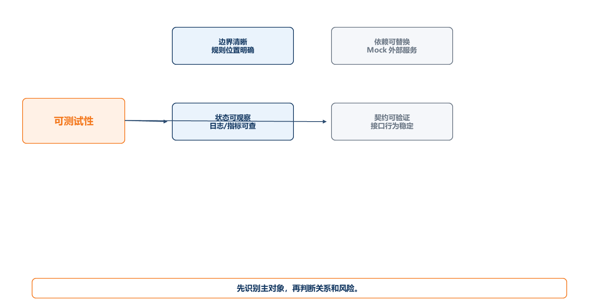
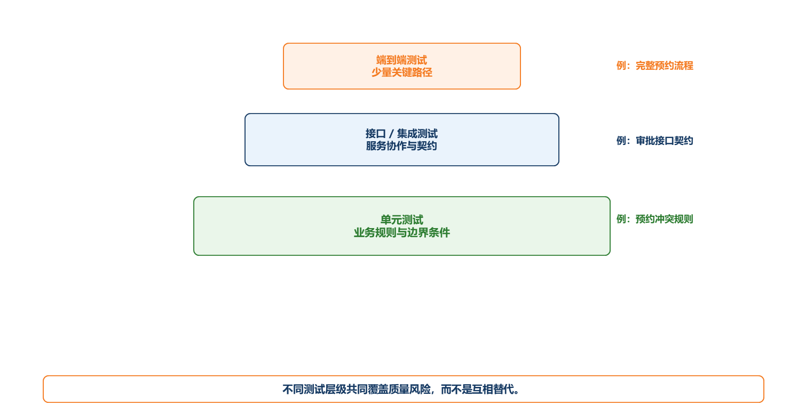
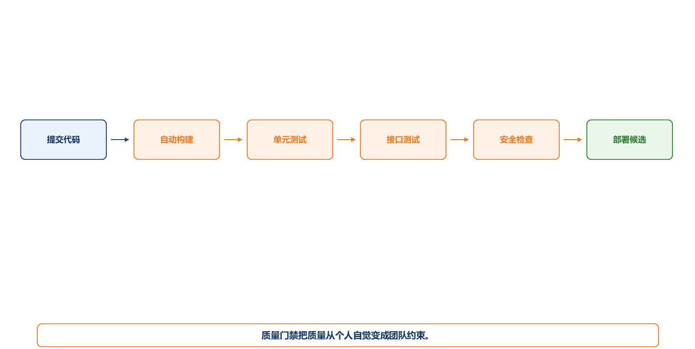

# 第7章 软件测试、质量保障与安全验证

## 7.1 本章导读：测试不是最后找 Bug，而是验证架构判断

软件测试常被误认为开发完成后的检查工作。实际上，能不能测试，往往在需求和架构阶段已经决定。若系统没有清晰边界、状态不可观察、依赖无法替换、业务规则散落在页面和数据库脚本中，测试会变得困难且低效。

实验室预约系统中的关键质量问题包括：预约冲突是否被阻止，权限越权是否被拒绝，通知失败是否不影响主流程，审批状态是否可追踪，数据统计是否可信。这些问题不能只靠人工点页面发现，而应通过单元测试、集成测试、接口测试、安全测试和质量门禁形成保障。

本章重点说明测试层级、可测试性、质量门禁、安全验证和缺陷管理。目标不是掌握所有测试工具，而是理解质量如何进入软件工程全过程。

【你要记住】测试不是系统完成后的补救动作，而是从需求、架构到交付持续验证工程判断的机制。

## 7.2 一个反面案例：所有逻辑都在 Controller 里

某预约系统把所有逻辑写在一个 Controller 中：读取请求参数、判断权限、查询设备、校验冲突、写数据库、发送通知、返回页面结果。演示阶段看起来能运行，但一写测试就暴露问题。

首先，业务规则无法单独测试。要测试预约冲突，必须启动 Web 服务、连接数据库、准备用户会话。其次，外部依赖无法替换。邮件服务不可用时，测试会随机失败。再次，异常路径难以覆盖。权限不足、设备维护、并发提交、通知失败都混在一个方法里。最后，缺陷定位困难。测试失败时，很难判断是参数解析、业务规则、数据库事务还是邮件调用出了问题。

改进方案是把业务规则放入服务层，把数据库访问封装到 Repository，把外部通知封装为适配器，把权限校验作为统一机制，把关键状态写入可观察日志。这样测试才能分层展开。

## 7.3 可测试性：架构给测试创造条件

可测试性是系统容易被验证的程度。它不是测试人员单独决定的，而是由架构边界、依赖管理、状态可观察性和接口契约共同决定。

对实验室预约系统来说，若“冲突检测”是一个独立业务服务，就可以构造不同时间段、不同设备、不同预约状态进行单元测试；若通知发送通过接口抽象，就可以在测试中替换为 Mock；若系统记录状态转换日志，就能在失败时判断流程停在哪一步；若接口有明确契约，就能验证前后端和第三方服务的一致性。

【易错点】测试困难通常不是因为测试框架不够强，而是因为代码边界和依赖关系没有设计好。

**图7-1 架构可测试性条件**

图注：本图说明测试策略要回到架构结构，而不是只讨论测试工具。

**Mock、Stub 与契约测试**

Mock 和 Stub 都用于在测试中替代真实依赖。Stub 主要返回预设结果，例如让“通知服务”固定返回成功或失败；Mock 还会验证调用是否发生，例如检查系统是否在预约通过后调用了通知接口。契约测试关注服务之间的接口约定是否一致，适合前后端、后端与第三方服务之间的协作。

在实验室预约系统中，通知服务、统一认证、文件存储都可以在测试中用替身处理。这样做不是为了逃避真实集成，而是为了先验证业务规则，再在集成测试中验证真实依赖。

【易错点】Mock 不是把测试做假，而是让测试聚焦当前对象。真正上线前仍然需要集成测试和端到端测试。

## 7.4 测试金字塔：不同层级验证不同问题

测试金字塔通常包括单元测试、集成测试、接口/服务测试、端到端测试。底层测试数量多、运行快，适合验证业务规则和函数逻辑；上层测试数量少、成本高，适合验证关键流程和系统协作。

在实验室预约系统中，冲突检测规则适合单元测试；预约服务与数据库事务适合集成测试；预约接口和权限返回适合接口测试；“学生提交预约—教师审批—学生查看结果”适合端到端测试。

若所有测试都依赖浏览器端到端点击，测试成本会很高且定位困难。若只有单元测试，又无法保证模块之间协作正确。合理策略是分层验证。

**图7-2 测试金字塔与预约系统示例**

图注：本图说明不同测试层级不是互相替代，而是共同覆盖不同质量风险。

## 7.5 从质量属性到测试场景

质量属性要变成测试，必须写成可验证场景。

| 质量属性 | 场景 | 测试方式 |
|---|---|---|
| 一致性 | 两个用户同时预约同一设备同一时段 | 并发接口测试、数据库约束检查 |
| 安全性 | 学生访问审批接口 | 权限测试，期望返回403 |
| 可用性 | 通知服务不可用 | Mock通知失败，验证预约仍保存 |
| 性能 | 查询一周可预约时间段 | 接口性能测试 |
| 可维护性 | 新增审批规则 | 单元测试覆盖规则服务 |

这个表说明，质量属性不是写在文档里的形容词，而要进入测试设计。

**三类关键测试用例样例**

| 测试对象 | 前置条件 | 操作 | 期望结果 |
|---|---|---|---|
| 预约冲突并发测试 | 设备A在周三上午可预约 | 两个用户同时提交同一时段预约 | 只有一个请求成功，另一个返回冲突；数据库只有一条有效预约 |
| 权限越权测试 | 学生账号已登录 | 直接请求审批接口 | 返回403；不产生审批记录；记录权限拒绝日志 |
| 通知失败测试 | 通知服务模拟超时 | 学生提交预约并通过校验 | 预约记录保存成功；通知任务标记失败或待重试；主流程不回滚 |

这些测试用例体现了第6章的架构判断：一致性要求、权限边界和异步通知都必须能被验证。

## 7.6 质量门禁：把质量要求放进开发流程

质量门禁是团队在代码合并、构建、发布前设置的质量检查条件。常见门禁包括代码评审、静态检查、单元测试通过、接口测试通过、安全扫描、测试覆盖率阈值和构建成功。

课程项目可以采用轻量门禁：主分支合并前至少一名成员评审；关键业务规则必须有单元测试；接口变更必须更新说明；部署前必须跑通预约闭环；权限接口必须做越权测试。

门禁的意义不是增加形式，而是防止低质量代码在团队中扩散。没有门禁的项目，常见情况是“每个人本地都能跑，合到一起就坏”。

**图7-3 CI/CD 中的质量门禁**

图注：本图把质量门禁嵌入 CI/CD 流程，说明质量要求应在交付链路中自动执行。

**质量门禁清单**

| 阶段 | 门禁内容 | 不通过时的处理 |
|---|---|---|
| 合并前 | 代码评审、关键单元测试、接口说明更新 | 不允许合并主分支 |
| 发布前 | 预约闭环、权限测试、通知失败测试、数据库脚本检查 | 暂缓发布，修复后重新验证 |
| 答辩前 | 从零部署、测试账号、演示数据、已知问题说明 | 补齐交付材料，避免现场不可复现 |

【项目提示】课程项目的质量门禁可以很轻量，但必须写清“检查什么、谁负责、不通过怎么办”。

## 7.7 缺陷管理：Bug 不是一句“有问题”

一个可处理的缺陷报告应包含：标题、环境、复现步骤、实际结果、期望结果、严重程度、影响范围、截图或日志、负责人和状态。

例如，“预约失败”不是好缺陷描述。更好的写法是：“在Chrome浏览器中，学生A预约设备X的周三上午时段，系统提示成功，但教师端看不到待审批记录。复现步骤为……实际结果为……期望结果为……日志显示预约记录状态为草稿。”这样的缺陷才能被定位和修复。

缺陷还应分类：需求缺陷、设计缺陷、编码缺陷、数据缺陷、环境缺陷、权限缺陷。分类有助于发现系统性问题。

## 7.8 安全验证：权限、输入和数据边界

软件安全不是只在上线前扫描一次。课程项目至少应关注三类安全验证：认证授权、输入校验和敏感数据保护。

认证授权要验证未登录、角色不匹配、越权访问和接口绕过。输入校验要关注参数篡改、SQL注入风险、文件上传限制和异常字符。敏感数据保护要关注密码、联系方式、身份信息和日志脱敏。

在实验室预约系统中，学生不能访问审批接口，实验员不能修改系统管理员权限，普通用户不能通过修改预约ID查看他人记录。所有这些都应进入测试用例。

安全验证还应覆盖输入边界和日志审计。例如，预约ID不能通过修改 URL 查看他人记录；上传附件要限制类型和大小；日志中不应打印明文密码、身份证号或访问令牌；审批接口需要记录操作者、操作时间和结果。安全测试的核心不是“找黑客工具”，而是验证系统是否守住角色、接口和数据边界。

【考试提示】安全测试题常要求结合角色、接口、数据和日志说明。回答时不要只写“加强安全”，要写具体验证点。

## 7.9 AI辅助测试：可以提效，但不能替代判断

AI工具可以帮助生成测试用例、构造边界输入、解释日志和补充异常场景。但 AI 生成的测试必须由人审查，尤其是业务规则、安全边界和数据一致性问题。

例如，可以提示 AI 为“提交预约申请”生成正常场景、冲突场景、权限不足、设备维护、通知失败、并发提交等测试用例。项目组再根据真实规则筛选、补充和执行。

AI辅助测试的价值在于扩大思考范围，风险在于生成看似完整但不符合业务规则的用例。因此它应作为辅助，而不是质量责任的替代者。

## 7.10 项目实践：为预约系统设计测试包

课程项目建议提交一个轻量测试包。

| 内容 | 要求 |
|---|---|
| 测试范围 | 核心用例、关键质量属性、安全边界 |
| 单元测试 | 至少覆盖2个核心业务规则 |
| 接口测试 | 覆盖预约、审批、权限、通知 |
| 端到端测试 | 覆盖一个完整业务闭环 |
| 缺陷清单 | 至少记录并分析3个缺陷 |
| 质量门禁 | 说明合并和发布前检查条件 |

测试包的重点不是数量，而是能说明系统质量如何被验证。

本章到下一章的衔接：测试和质量门禁能验证系统是否可靠，但系统还需要被稳定发布、监控和恢复。第8章将讨论从开发完成到运行交付的工程闭环。

## 7.11 本章小结

1. 可测试性由架构边界、依赖替换、状态观察和接口契约共同决定。
2. 测试金字塔用于把不同风险分配到不同测试层级。
3. 质量属性必须转化为测试场景和度量标准。
4. 质量门禁把质量控制嵌入开发与发布流程。
5. 安全验证和 AI辅助测试都必须回到具体规则和责任边界。

## 7.12 复习题与参考答案要点

**基础概念题1：什么是可测试性？**
参考答案要点：系统容易被验证的程度，受边界清晰、依赖可替换、状态可观察、契约可验证等因素影响。

**基础概念题2：测试金字塔包括哪些层级？**
参考答案要点：单元测试、集成测试、接口/服务测试、端到端测试，底层多且快，上层少且成本高。

**基础概念题3：什么是质量门禁？**
参考答案要点：在代码合并、构建、发布前设置的质量检查条件，如测试通过、评审、安全扫描和构建成功。

**简答题1：为什么测试困难往往是架构问题？**
参考答案要点：若边界混乱、依赖不可替换、状态不可观察、业务规则散落，测试就难以隔离、构造和定位。

**简答题2：如何把“系统要安全”转化为可测试需求？**
参考答案要点：定义角色权限、接口访问规则、未授权返回、日志记录、输入校验和越权测试用例。

**案例分析题：预约系统通知服务不可用导致预约接口失败。请分析设计和测试问题。**
参考答案要点：通知与主流程耦合过强；应考虑异步通知或失败重试；测试应覆盖通知失败场景，验证预约记录是否正确保存。

**项目实践题：为课程项目设计一条质量门禁。**
参考答案要点：说明触发位置、检查内容、通过标准、失败处理和责任人。
