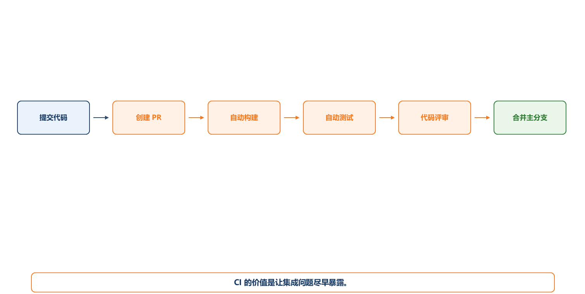
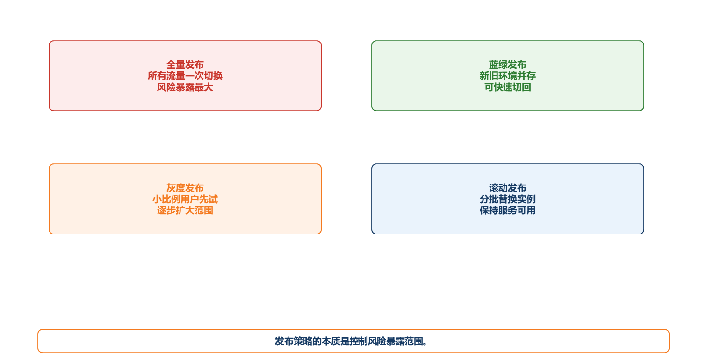
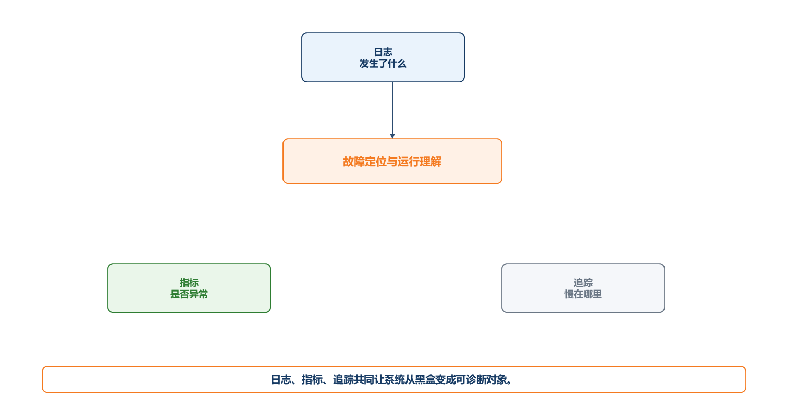
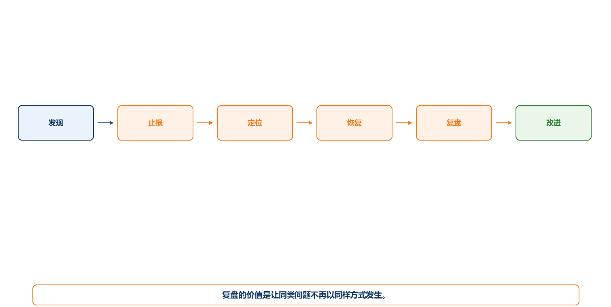

# 第8章 发布、交付、运维与可观测性

## 8.1 本章导读：完成开发不等于完成交付

软件系统真正进入使用，不是在代码写完时，而是在它能够稳定部署、可回滚、可监控、可排障、可持续演进时。很多学生项目在本地运行良好，但一到演示或部署环境就出现数据库连接失败、配置丢失、接口跨域、文件路径错误、版本不一致等问题。这些都属于交付工程的一部分。

实验室预约与设备管理系统如果要给学院试用，需要面对账号配置、数据库初始化、日志查看、邮件服务、权限配置、备份恢复、版本升级和故障处理。若没有发布与运维设计，系统只能停留在“开发机能跑”。

本章介绍持续集成、持续交付、发布策略、回滚、配置管理、可观测性和故障复盘。目标是让学生理解：交付能力也是软件体系结构和工程能力的重要组成部分。

【你要记住】交付不是把代码拷到服务器，而是让系统以可控方式进入真实运行环境。

## 8.2 一个反面案例：演示前一晚的手工发布

某项目组在答辩前一晚准备部署预约系统。后端在成员A电脑上能运行，前端在成员B电脑上能运行，数据库结构在群里传了一个SQL文件。部署到服务器后，后端无法连接数据库，因为配置文件路径不同；前端接口地址仍指向本地；邮件密码写在代码中，被提交到仓库；数据库缺少测试数据；系统报错后没有日志，只能猜测问题。

最后项目组花了数小时手工修改配置、重新导入数据库、临时关闭通知功能。系统勉强演示成功，但没有人能保证下次还能部署出来。

这类问题说明，发布交付不是最后一步小事，而是需要在开发过程中持续建设的能力。部署脚本、环境配置、版本记录、日志和回滚方案都应尽早准备。

## 8.3 持续集成：让问题尽早在公共环境暴露

持续集成（CI）强调团队成员频繁合并代码，并通过自动化构建和测试尽早发现集成问题。它解决的不是“个人代码能不能运行”，而是“团队代码合在一起是否仍然可用”。

对课程项目而言，CI 可以简化为：每次合并到主分支前自动检查代码能否构建、关键测试是否通过、依赖是否完整。即使没有复杂平台，也应保持固定集成节奏，不要等到最后一周才合并。

实验室预约系统的 CI 检查可以包括：后端测试通过、前端构建通过、接口契约未破坏、数据库迁移脚本可执行、关键配置项完整。

**图8-1 持续集成基本流程**

图注：本图说明持续集成如何把问题前移，避免把冲突积累到发布前。

## 8.4 持续交付：让版本随时具备发布候选状态

持续交付（CD）强调系统在通过必要检查后，能够随时形成可发布版本。它不一定意味着每次提交都自动上线，但意味着构建、测试、打包、配置和部署过程可重复。

课程项目可以把持续交付理解为：任何一个正式版本都能从仓库、脚本和说明文档重新部署出来。版本包应包含前后端构建产物、数据库初始化脚本、配置说明、启动命令、测试账号和回滚说明。

若系统只能依赖某个成员电脑上的隐含配置运行，就不具备交付能力。

【项目提示】答辩前至少做一次“从零部署演练”：换一台机器或新目录，按照部署说明重新运行系统。

需要区分持续交付和持续部署。持续交付强调版本随时具备发布候选状态，但是否上线可以由人工决策；持续部署则是在通过门禁后自动上线。课程项目通常不需要自动上线，但需要做到构建、配置、部署步骤可重复。

**从零部署检查表**

| 检查项 | 要求 |
|---|---|
| 运行环境 | 明确 JDK/Node/数据库版本和端口 |
| 配置文件 | 提供示例配置，敏感信息不入库 |
| 数据库 | 提供初始化脚本和测试数据 |
| 启动步骤 | 前端、后端、数据库启动顺序清楚 |
| 测试账号 | 至少包含学生、审批人、管理员 |
| 日志位置 | 说明错误日志和业务日志在哪里查看 |
| 回滚方式 | 说明如何恢复上一个可运行版本 |

## 8.5 发布策略：不要把所有用户一次性暴露给新版本

常见发布策略包括全量发布、蓝绿发布、灰度发布、滚动发布和金丝雀发布。课程项目不一定需要完整实现这些策略，但应理解它们解决的问题：降低发布风险、控制影响范围、支持快速回滚。

全量发布简单，但一旦新版本有问题，所有用户都会受影响。蓝绿发布准备两套环境，新版本在备用环境验证后切换流量。灰度或金丝雀发布先让少量用户使用新版本，观察指标稳定后再扩大范围。滚动发布逐步替换实例，适合多实例服务。

对实验室预约系统而言，若只是课程演示，可以使用简单版本发布；若给学院试用，至少要有备份、回滚和发布记录。若修改预约冲突规则，应先在测试环境验证，再安排低风险时间窗口发布。

**图8-2 常见发布策略对比**

图注：本图对比全量、蓝绿、灰度和滚动发布，帮助判断不同策略如何控制上线风险。

## 8.6 回滚与数据库变更：最容易被低估的交付风险

代码回滚相对容易，数据库回滚往往更困难。若新版本增加字段、改变状态含义、迁移历史数据，回滚时可能遇到数据不兼容。

实验室预约系统若把预约状态从“0/1/2”改成“待审批/已通过/已拒绝/已取消”，必须考虑旧数据如何迁移、接口如何兼容、回滚后新状态是否丢失。若只修改代码不管理数据库版本，系统很容易在升级后出现不可恢复错误。

因此，发布计划应包括数据库迁移脚本、备份策略、回滚条件和回滚步骤。对课程项目而言，至少要在部署说明中写清数据库初始化和升级方法。

【易错点】“能上线”不代表“能安全上线”。没有回滚方案的发布，本质上是在赌新版本不会出错。

**数据库迁移示例：预约状态字段调整**

| 步骤 | 说明 |
|---|---|
| 变更前 | 状态字段使用 `0/1/2`，含义依赖代码注释 |
| 变更目标 | 改为 `PENDING/APPROVED/REJECTED/CANCELLED` |
| 迁移动作 | 新增枚举映射脚本，先备份旧表，再执行数据转换 |
| 兼容风险 | 旧接口若仍返回数字状态，前端可能显示错误 |
| 回滚方案 | 保留备份表和旧字段映射，确认新版本稳定后再清理 |

【考试提示】发布与交付题常考“为什么数据库回滚难”。答题时要提到数据已经变化、历史记录可能不兼容、回滚必须配合备份和迁移脚本。

## 8.7 配置管理与环境一致性

配置包括数据库地址、账号密码、邮件服务、文件目录、端口、第三方接口、日志级别等。配置不应散落在代码中，更不应把真实密码提交到仓库。

环境通常包括开发环境、测试环境和生产/演示环境。不同环境配置可以不同，但结构应一致。例如都使用相同的配置项名称、相同的数据库迁移脚本、相同的启动方式。

实验室预约系统应把数据库连接、邮件服务、统一认证地址、文件上传目录放入配置文件或环境变量，并提供示例配置。敏感信息应使用占位符或本地私密配置，不应公开。

## 8.8 可观测性：出问题时能看见系统内部发生了什么

可观测性通常包括日志、指标和链路追踪。日志记录事件和上下文，指标反映系统状态和趋势，链路追踪帮助理解一次请求经过哪些服务。

课程项目可以从日志和关键指标开始。实验室预约系统至少应记录：登录用户、预约提交、审批操作、权限拒绝、通知失败、异常堆栈和关键状态变化。指标可以包括预约数量、审批通过率、通知失败次数、接口错误率和响应时间。

可观测性的目标不是收集大量数据，而是在故障发生时能回答：发生了什么，影响谁，在哪个环节，是否仍在扩大，如何恢复。

**图8-3 可观测性三支柱**

图注：本图说明日志、指标、追踪共同让系统从黑盒变成可诊断对象。

**预约系统日志与指标示例**

| 类型 | 示例 | 用途 |
|---|---|---|
| 业务日志 | `reservation.submit.success`，记录用户、设备、时间段、预约ID | 追踪预约是否成功 |
| 权限日志 | `auth.denied.count`，记录角色、接口、时间 | 发现越权访问和配置错误 |
| 通知指标 | `notification.failed.count` | 判断通知服务是否异常 |
| 性能指标 | `api.reservation.query.duration` | 观察预约查询是否变慢 |
| 错误日志 | 异常栈、请求ID、用户角色 | 支持故障定位 |

可观测性要与第7章测试形成闭环：测试在上线前暴露问题，日志和指标在运行中暴露问题。

## 8.9 故障处理与复盘：把事故变成改进

系统故障不可完全避免。重要的是发现、止损、定位、恢复和复盘。

一个基本故障处理流程包括：确认现象、评估影响、暂停危险操作、保留日志、恢复服务、通知相关人员、记录根因、制定改进。复盘不应只是追究谁写错代码，而应分析为什么缺陷没有被测试、评审或监控提前发现。

例如，预约冲突故障发生后，复盘可能发现：前端做了冲突提示，但后端没有事务保护；测试没有并发场景；日志没有记录冲突原因；发布前没有回归测试。改进措施应对应这些根因。

**图8-4 故障复盘闭环**

图注：本图说明故障处理不是到恢复为止，还要通过复盘把经验转化为质量门禁和监控改进。

## 8.10 项目实践：提交一份交付与运维说明

课程项目建议提交一份轻量交付说明。

| 内容 | 要求 |
|---|---|
| 环境说明 | 运行环境、依赖版本、端口 |
| 部署步骤 | 前端、后端、数据库、配置 |
| 初始化数据 | 测试账号、基础设备数据 |
| 发布记录 | 版本号、变更内容、负责人 |
| 回滚方案 | 何时回滚、如何恢复 |
| 日志与监控 | 日志位置、关键指标、故障排查 |
| 已知限制 | 暂未解决问题和后续计划 |

这份说明能让系统从“某个成员电脑上能跑”变成“别人也能部署和维护”。

## 8.11 本章小结

1. 交付能力包括构建、部署、配置、版本、回滚和运行诊断。
2. 持续集成让团队尽早发现集成问题，持续交付让版本保持可发布状态。
3. 发布策略的核心是控制风险范围，回滚方案是安全发布的必要条件。
4. 可观测性帮助系统在故障时可定位、可恢复、可改进。
5. 课程项目应至少提供可重复部署说明、基础日志和版本记录。

## 8.12 复习题与参考答案要点

**基础概念题1：什么是持续集成？**
参考答案要点：团队频繁合并代码，并通过自动化构建和测试尽早发现集成问题。

**基础概念题2：什么是可观测性？**
参考答案要点：通过日志、指标和追踪理解系统运行状态、定位故障和支持恢复的能力。

**基础概念题3：蓝绿发布和灰度发布的区别是什么？**
参考答案要点：蓝绿发布在两套环境间切换流量；灰度发布逐步扩大用户范围，观察稳定后再全量。

**简答题1：为什么数据库变更比代码回滚更难？**
参考答案要点：数据结构和历史数据可能已改变，回滚可能造成数据丢失或不兼容，需要迁移、备份和回滚计划。

**简答题2：课程项目为什么也需要部署说明？**
参考答案要点：保证系统可重复运行，减少环境依赖，支持答辩演示、评审复现和后续维护。

**案例分析题：某系统上线后通知失败但没有日志，无法判断预约是否成功。请提出改进。**
参考答案要点：记录预约状态变化、通知调用结果和异常日志；通知失败不应破坏主流程；增加指标和告警；设计重试或补偿机制。

**项目实践题：为课程项目写一份交付清单。**
参考答案要点：包含运行环境、部署步骤、数据库初始化、配置说明、版本记录、回滚方案和日志位置。
